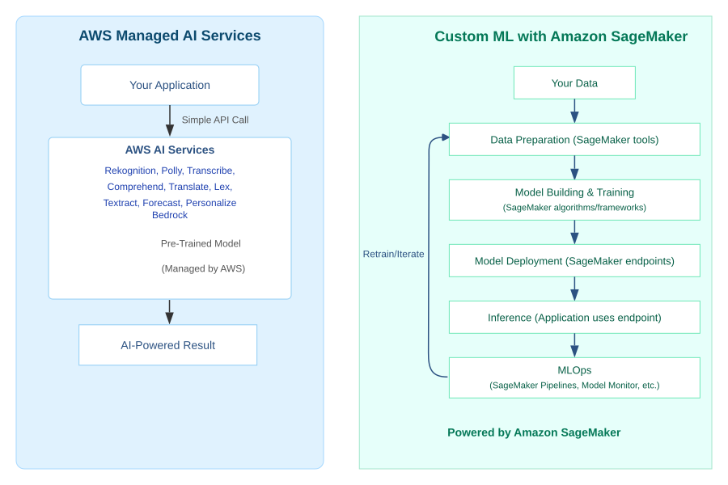
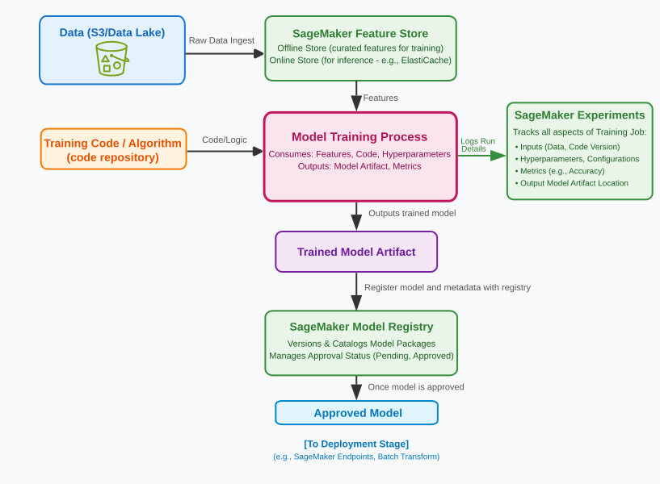
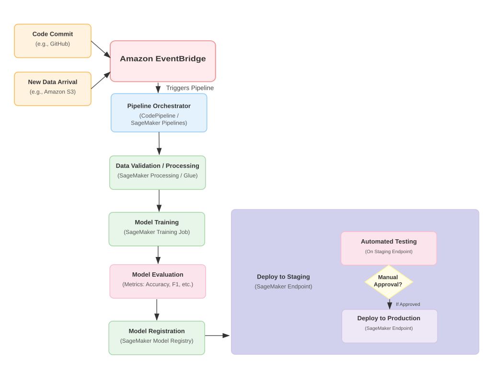
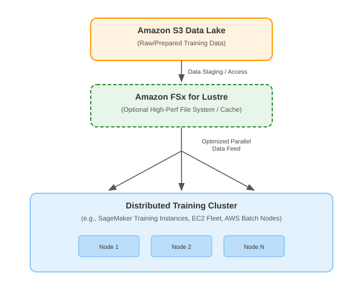
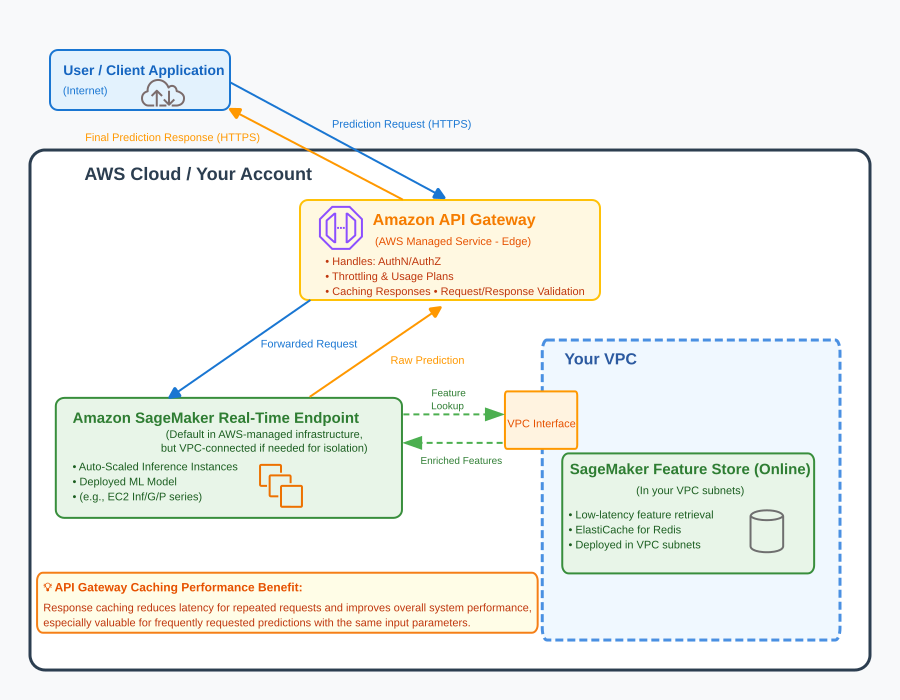

## 3.9 From Data to Decisions: Architecting AI and Machine Learning Systems on AWS

It was around 2011, and I found myself in a cramped university lab, surrounded by earnest PhD students. Their project was ambitious for the time: building a personalized recommendation engine for a vast library of academic papers. The algorithms were brilliant, painstakingly coded in Python with early machine learning libraries. The challenge? Infrastructure. They had a handful of aging, rack-mounted servers, constantly battling for compute cycles and struggling to process even a fraction of the dataset they needed to train their models effectively. "If only we had a thousand machines for a week," one student lamented, "we could actually test this properly. But the grant money for hardware ran out ages ago." Their dream of a system that could intelligently guide researchers to relevant knowledge was being throttled by the sheer physical and financial limitations of accessing the necessary compute power and managing the complex software stack.

That scenario, a common one in the early days of more democratized AI/ML experimentation, starkly contrasts with the capabilities available today. The rise of cloud computing, and specifically the rich ecosystem of services on AWS, has transformed Artificial Intelligence (AI) and Machine Learning (ML) from a niche academic pursuit or the domain of a few tech giants into a powerful toolkit accessible to organizations of all sizes. However, architecting for AI/ML workloads introduces a unique set of demanding non-functional requirements. We're talking about systems that often require:

* **Massive Computational Power:** Training complex models can consume hundreds or even thousands of CPU or, more commonly, specialized GPU (Graphics Processing Unit) or custom ML accelerator (like AWS Trainium or Inferentia) hours.
* **Handling Extremely Large Datasets:** ML models are data-hungry, often requiring terabytes or petabytes of information for training and validation.
* **Specialized Hardware:** GPUs and other accelerators are frequently essential for achieving acceptable training times and efficient inference performance.
* **A Complex Lifecycle (MLOps):** The journey from raw data to a deployed, monitored, and retrained ML model involves a sophisticated, iterative lifecycle known as MLOps (Machine Learning Operations), which requires its own specialized tooling and operational practices.
* **Dual Performance Needs:** AI/ML systems often have two distinct performance profiles – the high-throughput, often long-running demands of model training, and the low-latency, high-concurrency needs of real-time model inference (making predictions).

This section delves into the fascinating world of architecting these AI and Machine Learning systems on AWS. We'll explore how cloud services provide the elastic compute, scalable storage, specialized hardware, and integrated tooling necessary to tackle these challenges. It represents a significant shift in architectural thinking, moving beyond traditional application hosting or even large-scale data analytics into a realm where the infrastructure itself must be deeply intertwined with the data science and model development lifecycle. We'll begin by understanding the fundamental approaches to leveraging AI/ML on AWS, distinguishing between using pre-built AI services and embarking on the journey of custom model development.

### Overview: Approaches to AI/ML on AWS

When organizations look to infuse their applications and business processes with artificial intelligence and machine learning, AWS offers two primary pathways. The choice between them depends heavily on the problem you're trying to solve, the uniqueness of your data, the level of customization required, and the ML expertise available within your team.

The first, and often simplest, approach is to leverage **AWS Managed AI Services**. I often describe these to clients as highly specialized, pre-tuned power tools. If you need to perform a common AI task – like recognizing objects or faces in images, converting speech to text, translating languages, or understanding the sentiment in customer reviews – chances are AWS has already done the heavy lifting of building, training, and optimizing a sophisticated model for that purpose. Your application simply makes an API call to the relevant service, sends the data (an image, an audio file, a block of text), and receives the AI-powered result. There's no need to understand the intricacies of neural network architectures, manage training data, or worry about deploying and scaling ML models yourself.

Key examples of these managed AI services, which you should be aware of for the SAA exam, include:

* **Vision:**
  * **Amazon Rekognition:** Provides automated image and video analysis. You would use Rekognition to identify objects, people, text, scenes, and activities in your images and videos, or for tasks like content moderation (e.g., detecting inappropriate content) and facial recognition. It's API-driven; you send an image or video, and Rekognition returns JSON metadata with the analysis, powered by pre-trained deep learning models managed by AWS.
* **Speech:**
  * **Amazon Polly:** Converts text input into lifelike speech. This is ideal for creating audio versions of articles, powering voice prompts in interactive voice response (IVR) systems, or generating speech for accessibility features in applications. You send text via an API and receive an audio stream or file in various voices and languages, all managed by AWS.
  * **Amazon Transcribe:** Performs automatic speech recognition (ASR) to convert audio speech into text. Common use cases include transcribing customer service calls for quality analysis, creating subtitles for video content, or enabling voice control in applications by converting spoken commands to text. It's API-driven and supports various languages and audio formats.
* **Language:**
  * **Amazon Comprehend:** A Natural Language Processing (NLP) service used to extract insights and relationships from text documents. You might use it to analyze customer reviews for sentiment (positive, negative, neutral), identify key phrases, detect entities (like people, places, organizations, or commercial items), or perform topic modeling. It's API-driven, taking text as input and returning structured insights from its pre-trained models.
  * **Amazon Translate:** Provides real-time and batch language translation for text. It's used for translating website content for global audiences, localizing applications, or enabling multilingual communication in chat applications. You send text and specify source/target languages via API.
  * **Amazon Lex:** Enables developers to build conversational interfaces (chatbots and voice bots) for applications. It provides the deep learning-powered NLP and Automatic Speech Recognition (ASR) needed to understand user intent from natural language input (voice or text) and then triggers appropriate backend logic (often AWS Lambda functions) to fulfill the user's request. It's the technology behind Amazon Alexa.
  * **Amazon Textract:** Automatically extracts text, handwriting, and data from scanned documents, PDFs, and images. Unlike simple Optical Character Recognition (OCR), Textract can also identify the contents of fields in forms and information stored in tables, making it invaluable for automating data entry from documents like invoices, receipts, or insurance claims.
* **Forecasting/Recommendations:**
  * **Amazon Forecast:** A fully managed service for time-series forecasting, using machine learning to deliver more accurate predictions than traditional methods. It's used for scenarios like predicting product demand, inventory levels, or future resource needs, based on historical time-series data.
  * **Amazon Personalize:** Allows developers to build applications with real-time personalized recommendations for users, similar to those used by Amazon.com. It simplifies the process of creating, training, and deploying custom recommendation models for use cases like product recommendations, personalized content suggestions, or targeted promotions.
* **Foundation Models via API:**
  * **Amazon Bedrock:** Provides a straightforward way to access and use a range of powerful, pre-trained **foundation models (FMs)** from leading AI companies (including AI21 Labs, Anthropic, Cohere, Meta, Stability AI, and Amazon itself) for text generation, chatbots, search, summarization, image generation, and embedding through a single, unified API. You'd choose Bedrock when you want to leverage the capabilities of these large-scale model — for tasks like text generation, summarization, question answering, chatbot creation, or image generation — without managing the complex underlying infrastructure required to host and serve them. Bedrock also allows for private customization of these FMs using your own data, enabling you to tailor their responses to your specific domain or use case while maintaining data privacy. It offers a serverless experience, making it easier to build and scale generative AI applications.

These services are incredibly powerful for quickly adding AI capabilities to applications without requiring deep ML expertise. They are designed to be scalable, reliable, and cost-effective for common use cases.

However, what if your AI/ML needs are more specialized? What if you're not just recognizing generic objects, but trying to identify specific, subtle defects in *your* company's unique manufacturing line based on sensor data? Or perhaps you need to predict customer churn based on *your* proprietary business data and customer interaction patterns, requiring a model tailored precisely to your domain. This is where the pre-built tools, as powerful as they are, might not be sufficient. For these scenarios, organizations embark on the journey of building, training, and deploying **Custom ML Models**.

This second approach involves a more significant investment in data science expertise and a more intricate development lifecycle. It's here that **Amazon SageMaker** emerges as the central, integrated platform. SageMaker is a fully managed service designed to support the entire custom machine learning lifecycle. It provides data scientists and developers with the tools to:

* Prepare and label large datasets.
* Choose from a wide range of built-in ML algorithms or bring their own.
* Manage and execute model training jobs at scale, often leveraging powerful GPU instances.
* Tune model hyperparameters for optimal performance.
* Deploy trained models to scalable, secure endpoints for real-time inference or use them for batch predictions.
* Manage the entire MLOps workflow, including model versioning, monitoring, and retraining.

The figure below offers a conceptual contrast between these two approaches. On one side, AWS Managed AI Services offer a direct API path from your application to pre-trained models, delivering quick AI-powered results. On the other, building Custom ML Models with Amazon SageMaker involves a more comprehensive, cyclical process of data preparation, model training, deployment, and ongoing operational management.

<figure style="text-align: center;">
  
  <figcaption style="font-style: italic; color: #555;">Contrasting Approaches: AWS Managed AI Services vs. Custom ML with Amazon SageMaker.</figcaption>
</figure>

While consuming managed AI services is often straightforward, the architectural depth, complexity, and the majority of exam-relevant design considerations for AI/ML systems on AWS lie within the realm of custom model development. Therefore, the remainder of Section 3.8 will focus primarily on the infrastructure, operational considerations, and architectural patterns associated with building, training, deploying, and managing these custom AI/ML models using Amazon SageMaker and related AWS services.

For the Solutions Architect - Associate exam, it's important to understand the fundamental distinction between using AWS's pre-trained, managed AI services and building custom machine learning models. You should be familiar with the names and primary functions of key managed AI services like Amazon Rekognition (image/video analysis), Amazon Transcribe (speech-to-text), Amazon Polly (text-to-speech), Amazon Comprehend (NLP), Amazon Translate (translation), Amazon Lex (chatbots), and Amazon Textract (document analysis). Recognize scenarios where these API-driven services are the most appropriate and cost-effective solution.

Equally, or perhaps more importantly for architectural questions, understand that **Amazon SageMaker** is the primary, integrated platform for the entire custom ML lifecycle. While you don't need to be an ML expert, grasp that SageMaker provides tools for data preparation, model training, deployment, and MLOps. The exam will likely test your ability to select appropriate AWS services and architectural patterns to support the various stages of building and deploying custom ML models, considering factors like compute requirements, data storage, scalability, and operational management.

With this understanding of the two main paths to AI/ML on AWS, and our subsequent focus on the more architecturally intensive journey of custom model development, we must first address how to manage the intricate lifecycle of these custom models effectively. This brings us to the discipline of MLOps (Machine Learning Operations), which is essential for building, deploying, and maintaining ML models in a reliable, repeatable, and scalable manner. The next section will explore these crucial operational practices.

## 3.8.1 From Algorithm to Operation: Mastering the MLOps Lifecycle

In the previous section, we established that while AWS offers a suite of powerful, pre-trained AI services for common tasks, there are many scenarios where organizations need to build, train, and deploy their own custom Machine Learning (ML) models to address unique business problems or leverage proprietary datasets. This journey into custom ML is incredibly powerful, capable of unlocking transformative insights and intelligent automation. However, it's a path laden with complexities that extend far beyond just writing clever algorithms or training a model in a development environment.

The real challenge, as many organizations quickly discover, lies in operationalizing these custom ML models – reliably moving them from an experimental stage to robust production deployment, and then maintaining their performance and relevance over time. This is where the discipline of **MLOps (Machine Learning Operations)** becomes absolutely essential. It's about taming the inherent complexities of the ML lifecycle, applying engineering rigor to what can often feel like an artisanal craft, and ensuring that our intelligent algorithms translate into tangible, reliable business value.

This section will delve into these crucial operational management requirements for custom AI/ML systems. We’ll explore the core principles of MLOps, the AWS services (with a central focus on **Amazon SageMaker** and its components) that enable these practices, and how to build automated, repeatable, and scalable workflows for the entire ML lifecycle, from data preparation and experimentation through to model deployment, monitoring, and retraining.

### Foundations of MLOps: Defining the Discipline and Key Concepts

I vividly recall the enterprise AI landscape in the early to mid-2010s. The excitement around ML was palpable, but the reality of bringing models into production was often a story of heroic efforts and frustrating bottlenecks. Data scientists, armed with tools like R or Python in Jupyter notebooks, would perform brilliant feats of model creation. They’d meticulously clean data, experiment with algorithms, and finally, after weeks or months, produce a model that showed great promise on their local machine or a single powerful server. The triumphant declaration, "The model is ready!" often marked not the end of the journey, but the beginning of a new set of headaches.

"Productionizing" that model was frequently a case of throwing it over the wall to an engineering team. This team, often unfamiliar with the intricacies of the ML libraries used or the specific data preprocessing steps required, would struggle to replicate the data scientist's environment. Dependencies would clash, performance in a production setting would mysteriously differ from the lab, and once deployed, the model often became a "black box" – its predictions slowly degrading over time as real-world data patterns drifted, with no clear process for monitoring or retraining. Versioning was haphazard, experiments were poorly tracked, and collaboration between the data science "artists" and the operational "engineers" was strained. It was clear that a more systematic, disciplined approach was needed to bridge this gap between brilliant ML experimentation and reliable ML operation. This critical need gave birth to MLOps.

**MLOps (Machine Learning Operations)** is fundamentally about applying the principles and practices of DevOps – such as automation, continuous integration/continuous delivery (CI/CD), version control, testing, and monitoring – to the entire lifecycle of machine learning. The goal is to make the process of building, deploying, and maintaining ML models more efficient, reliable, scalable, and reproducible. Key principles underpinning MLOps include:

* **Automation:** Automating every feasible step of the ML workflow, from data ingestion, validation, and preprocessing, through model training and evaluation, to model deployment and monitoring. This reduces manual effort, minimizes errors, and accelerates iteration.
* **Versioning:** Rigorously versioning all assets involved in the ML process. This isn't just about versioning the model training code (e.g., using Git). It extends to versioning the datasets used for training and testing, the features derived from that data, the model artifacts themselves, the configurations used for training and deployment, and even the pipeline definitions that orchestrate the workflow.
* **Testing:** Implementing a comprehensive suite of automated tests throughout the lifecycle. This includes tests for data quality and validity, unit and integration tests for feature engineering and model training code, model validation tests to assess performance against predefined metrics, and tests for the operational health of deployed model endpoints.
* **Monitoring:** Continuously monitoring deployed models in production for not only operational metrics (like latency and error rates of the inference endpoint) but also for model quality (e.g., accuracy, precision, recall) and, crucially, for **data drift** (statistical changes in the input data over time) and **concept drift** (changes in the underlying relationships the model learned). This monitoring is key to detecting model degradation and triggering retraining.
* **Collaboration:** Fostering close collaboration and shared responsibility between data scientists, ML engineers, software developers, and operations teams. MLOps provides common tools and processes that bridge these often-siloed disciplines.
* **Reproducibility:** Ensuring that ML experiments and model training processes are fully reproducible. Given the same data, code, and environment, you should be ableto achieve the same model output. This is vital for debugging, auditing, regulatory compliance, and building trust in ML systems.

Achieving these MLOps principles from scratch, building all the necessary tooling and infrastructure, would be a monumental undertaking for most organizations. This is where **Amazon SageMaker** shines as a comprehensive, integrated, and fully managed platform designed to support the entire MLOps lifecycle.

When we first discussed Amazon SageMaker in Section 3.8.0, we introduced it as the primary platform for building custom ML models. Now, let's expand on its role as the operational engine for MLOps. SageMaker isn't a single tool; it's an extensive suite of services and features that provide the building blocks for each stage of the ML journey, significantly reducing the undifferentiated heavy lifting associated with managing ML infrastructure and workflows. Think of SageMaker as providing a fully equipped, state-of-the-art laboratory and production facility specifically designed for machine learning. Instead of you having to procure specialized hardware, install complex software frameworks, build data pipelines from scratch, and invent your own deployment mechanisms, SageMaker offers these capabilities as managed services, allowing your team to focus on the data science and business problem rather than infrastructure plumbing.

Key capabilities of the SageMaker platform that underpin MLOps include:

* **Data Preparation and Labeling:** Tools like SageMaker Data Wrangler for visual data preparation and SageMaker Ground Truth for creating high-quality training datasets.
* **Experimentation and Model Development:** Managed Jupyter notebook instances (SageMaker Studio or Notebook Instances) provide familiar environments for data scientists to explore data and develop model code. SageMaker comes with built-in, optimized algorithms for common ML tasks, and also supports bringing your own algorithms or using popular open-source frameworks like TensorFlow, PyTorch, scikit-learn, and XGBoost.
* **Managed Training Infrastructure:** When it's time to train a model, SageMaker can provision and manage the necessary compute infrastructure, including fleets of powerful EC2 CPU or GPU instances (including specialized instances with AWS Trainium chips). It handles the complexities of distributed training for large models, automatically scaling resources and managing their lifecycle.
* **Model Hosting and Deployment:** Once a model is trained, SageMaker provides multiple options for deploying it to make predictions. This includes creating real-time inference endpoints that can automatically scale to handle varying request loads, or running batch transform jobs to get predictions on large datasets. It also supports deploying models to edge devices via SageMaker Edge Manager.
* **Integrated MLOps Tooling:** Crucially for this section, SageMaker provides a suite of integrated tools specifically designed for MLOps, which we will explore in detail in the subsequent subsections. These include **SageMaker Experiments** for tracking training runs, **SageMaker Feature Store** for managing ML features, **SageMaker Model Registry** for cataloging and versioning models, **SageMaker Pipelines** for orchestrating end-to-end ML workflows, and **SageMaker Model Monitor** for detecting drift in deployed models.

By providing these managed capabilities across the entire lifecycle, from initial data exploration to production model monitoring, Amazon SageMaker allows organizations to implement robust MLOps practices more efficiently and effectively than if they were to build and manage all the constituent pieces themselves. It truly democratizes the ability to operationalize machine learning at scale.

Before we delve deeper into these specific MLOps components, it's essential to clearly define two fundamental phases that MLOps aims to manage and automate: **Model Training** and **Model Inference**.

* **Model Training:** This is the process where the "learning" in machine learning happens. Think of it as a chef meticulously perfecting a new, complex recipe in a test kitchen. The chef (your ML algorithm) takes a large set of historical ingredients (your training dataset, e.g., past customer behavior and whether they churned) and experiments with different cooking techniques and ingredient combinations (algorithm hyperparameters). Through an iterative process of "cooking" (running the algorithm on the data) and "tasting" (evaluating the model's performance on a validation dataset – "Does this recipe accurately predict which past customers would have churned?"), the chef refines the recipe until it consistently produces the desired outcome (a trained model that can accurately predict future churn). This training phase is often computationally intensive, can take hours or even days for complex models and large datasets, and involves a lot of experimentation to find the best "recipe." The output is the perfected recipe itself – the trained model artifact.
* **Model Inference (or Prediction):** Once the chef has perfected the recipe (the model is trained), the restaurant kitchen (your production application) can now use that recipe to prepare dishes for actual diners. This is model inference. When a new customer (new, unseen data) comes in, the kitchen staff (your deployed model endpoint) takes their order (the input features for the new customer), precisely follows the perfected recipe (applies the trained model's logic), and serves the dish (generates a prediction, e.g., "this new customer has an 85% probability of churning"). Inference can happen in two main ways:
  * **Real-time (or Online) Inference:** Predictions are made on demand, typically for a single input or a small batch, with a low-latency response expected. This is common for interactive applications, like a website providing instant product recommendations as a user browses.
  * **Batch Inference:** Predictions are generated for a large collection of inputs all at once, typically as a scheduled offline process. For example, running a trained fraud detection model against all of yesterday's transactions to identify suspicious ones.

Understanding this distinction is crucial because MLOps provides practices and tools to manage and automate both the intricate, iterative "recipe perfection" (training) phase and the efficient, reliable "dish execution" (inference) phase, ensuring a smooth flow from the experimental kitchen to the busy restaurant floor.

### Core Components of the MLOps Lifecycle: Managing Data and Models

With the foundational principles of MLOps and the core concepts of training versus inference established, we can now explore the key Amazon SageMaker components that help manage the crucial assets throughout the pre-deployment stages of the Machine Learning lifecycle. These components are essential for bringing order, traceability, and reusability to the often complex and iterative process of developing high-quality ML models. We’ll look at how to manage and track experiments, how to centralize and govern the features that feed our models, and how to catalog and version the trained models themselves.

First, in the exploratory and iterative phase of model development, data scientists run numerous training jobs, tweaking algorithms, adjusting hyperparameters, and trying different feature sets to find the optimal model. Keeping track of all these variations manually – which dataset was used with which code version and what parameters to produce which set of metrics – quickly becomes an unmanageable nightmare, especially in a team setting. This is where **Amazon SageMaker Experiments** comes in. It's a fully managed capability that allows you to organize, track, compare, and evaluate all your machine learning training iterations, known as "experiments", "trials", and "trial components". You can automatically log all the inputs (like datasets from S3, training script locations, instance types used), parameters (hyperparameters, environment variables), configurations, and output metrics (like accuracy, F1-score, AUC) for each training run. This creates an invaluable, auditable record, making it easy to reproduce past results, compare the performance of different model versions, and understand exactly how a specific model was trained. For teams, it provides a shared, consistent view of all experimentation efforts, greatly enhancing collaboration and knowledge sharing.

Once you start building models, you'll quickly realize that the quality and consistency of the data you feed them – the "features" – are paramount. Features are the individual measurable properties or characteristics used as input to an ML model. For example, for a customer churn model, features might include customer age, purchase frequency, average order value, and tenure. Often, data scientists and ML engineers spend a significant amount of time creating these features from raw data sources through a process called feature engineering. Without a centralized way to manage these features, different teams or even different models might use slightly different versions or definitions of the same logical feature, leading to inconsistencies, redundant processing, and challenges in maintaining model accuracy over time. This is the problem that **Amazon SageMaker Feature Store** is designed to solve.

SageMaker Feature Store is a fully managed, purpose-built repository that allows you to store, share, discover, and manage curated ML features for both training and inference, at scale. Think of it as a well-organized chef's pantry specifically for ML features. Instead of every data scientist or every model training pipeline having to independently prepare the same "ingredients" (features) from raw data sources every time – a process that can be time-consuming and prone to generating slight variations – the Feature Store provides a central place for standardized, versioned, and trusted features. Key capabilities include:

* **Feature Groups:** Features are organized into logical collections called feature groups.
* **Online and Offline Store:** SageMaker Feature Store provides two types of stores:
  * An **Offline Store** (typically backed by Amazon S3) is optimized for storing large volumes of historical feature data, primarily used for model training or batch inference jobs.
  * An **Online Store** is designed for low-latency, real-time retrieval of the latest feature values during model inference. This online store needs to be incredibly fast to serve features to live prediction endpoints without adding significant latency. While SageMaker Feature Store manages the online store's infrastructure, it often leverages a high-performance, in-memory data store under the hood. **AWS ElastiCache**, particularly using its **Redis engine** (which we first encountered in Section 3.1.2 for web application caching and in 3.3.3 for internal database caching), is commonly used here. ElastiCache for Redis provides the microsecond latency and high throughput needed to serve features rapidly to, for example, a SageMaker real-time endpoint that needs to enrich incoming prediction requests with fresh feature values before feeding them to the model.
* **Feature Definition and Ingestion:** You define feature schemas and can ingest features from various sources, including SageMaker Data Wrangler or custom processing jobs.
* **Versioning and Consistency:** Features are versioned, helping to ensure consistency between the features used for training a model and those used for serving predictions (which helps avoid "training-serving skew," a common source of model performance degradation in production).

By using SageMaker Feature Store, data science teams can significantly reduce redundant feature engineering efforts, improve collaboration by sharing curated features, ensure consistency in feature usage across different models and environments, and accelerate the path from raw data to production-ready features, all while maintaining governance and traceability.

After numerous experiments (tracked with SageMaker Experiments) using well-defined features (managed by SageMaker Feature Store), you'll eventually train a model that meets your performance criteria. But what happens next? Simply having a model artifact (like a `.tar.gz` file in S3) isn't enough for operationalizing it effectively. You need a way to catalog this trained model, store its associated metadata (like which training job produced it, its performance metrics, the S3 location of its artifacts, the container image needed for inference), manage its versions as you retrain or improve it, and control its approval status before it can be deployed. This is the crucial role of the **Amazon SageMaker Model Registry**.

The Model Registry acts as a central, version-controlled catalog for all your trained machine learning models. When you register a model, you typically create a "model package group" (e.g., for your "customer-churn-predictor") and then register specific versions of your trained model artifacts as "model packages" within that group. Each model package can store:

* The S3 location of the trained model artifact.
* The inference Docker container image URI.
* Metadata about the training job, evaluation metrics, and any custom tags.
* Crucially, an **approval status** (e.g., `PendingManualApproval`, `Approved`, `Rejected`).

This approval status is key for governance. Before a model version can be deployed to production (or even staging), it can be put through a formal review and approval process within the Model Registry. This ensures that only validated and blessed model versions make their way into production environments. The Model Registry also integrates directly with SageMaker's deployment capabilities and SageMaker Pipelines, allowing automated CI/CD workflows to register new model versions and trigger deployments based on their approval status.

The figure below provides a conceptual view of how these core SageMaker components – Experiments, Feature Store, and Model Registry – interact in the pre-deployment stages of the MLOps lifecycle. Raw data, often originating from an S3 data lake, is processed and transformed into features that are ingested into the SageMaker Feature Store. Data scientists then use these features, along with their model training code, to run numerous training jobs, with all parameters, configurations, and results meticulously tracked by SageMaker Experiments. Once a promising model is trained, its artifact and associated metadata are registered as a versioned model package in the SageMaker Model Registry, where it can await approval before being considered for deployment. This structured flow, facilitated by these integrated SageMaker services, brings order and traceability to the iterative process of model development.

<figure style="text-align: center;">
  
  <figcaption style="font-style: italic; color: #555;">Core SageMaker MLOps Components in the Pre-Deployment Lifecycle.</figcaption>
</figure>

As the diagram illustrates, **SageMaker Experiments** acts as the logbook for all your training attempts, ensuring no successful (or failed) experiment is lost. The **SageMaker Feature Store** provides the standardized, high-quality ingredients needed for both training and, later, consistent real-time inference (leveraging its online store, often backed by the speed of **ElastiCache for Redis**). Finally, the **SageMaker Model Registry** serves as the secure, version-controlled vault for your trained model "recipes," ensuring only approved and well-documented models are ready to move forward to deployment. Together, these components form the backbone of a well-managed and auditable pre-deployment MLOps workflow, paving the way for automated and reliable model delivery.

### Automating the Machine Learning Pipeline: CI/CD and Integration

Having established the core components that help manage the intricate assets of the machine learning lifecycle – from tracking experiments with SageMaker Experiments and curating features in SageMaker Feature Store, to versioning and approving models in SageMaker Model Registry – our focus now shifts to weaving these elements into a cohesive, automated workflow. In the artisanal past of ML development, moving from a promising experiment to a deployed model often involved a series of manual handoffs, ad-hoc scripts, and a prayer that nothing broke along the way. To truly operationalize machine learning at scale and achieve the agility demanded by modern business, we must embrace robust automation. This is where the principles of Continuous Integration and Continuous Delivery/Deployment (CI/CD), battle-tested in the software engineering world, are adapted and extended for the unique needs of the ML lifecycle.

The goal is to create a well-oiled "digital assembly line" for our models. This isn't just about automating the deployment of a finished model; it's about automating the entire journey: from ingesting and validating new data, through preprocessing and feature engineering, to model training, rigorous evaluation, versioning, and finally, controlled deployment to production environments. This end-to-end automation is what **Amazon SageMaker Pipelines** and other AWS developer tools like **AWS CodePipeline** are designed to facilitate.

Think of traditional CI/CD for software, which typically focuses on building, testing, and deploying application *code*. CI/CD for Machine Learning (often called MLOps CI/CD or ML pipelines) expands this scope considerably because it deals not just with code, but also with data and models, each of which has its own lifecycle and versioning needs. A typical CI/CD pipeline for ML models might involve several key stages:

1. **Trigger & Source:**
   The pipeline is usually initiated by a trigger. Common triggers include:
   * A code commit to a source control repository (e.g., **AWS CodeCommit** for existing users, or other Git-based systems like GitHub/GitLab integrated via webhooks or AWS Connections) containing model training scripts, feature engineering logic, or pipeline definitions. (Note: As of July 2024, AWS CodeCommit is no longer accepting new customers, guiding them to these third-party Git platforms.)
   * The arrival of new data in an **Amazon S3** bucket (e.g., a fresh batch of training data), often detected via S3 Event Notifications that trigger an **Amazon EventBridge** rule.
   * A scheduled event (e.g., via EventBridge Scheduler) for periodic model retraining.
1. **Data Ingestion & Validation:** The pipeline fetches the necessary data, validates its quality and schema, and perhaps splits it into training, validation, and test sets. This might involve custom scripts or SageMaker Processing jobs.
1. **Feature Engineering:** Raw data is transformed into meaningful features suitable for model training. This stage can leverage SageMaker Feature Store for consistency or involve custom processing jobs.
1. **Model Training:** The core training process is executed, often using SageMaker managed training jobs, which can utilize various built-in algorithms or custom training scripts running in Docker containers. All parameters and metrics are ideally logged to SageMaker Experiments.
1. **Model Evaluation & Testing:** The trained model is evaluated against a holdout test dataset to assess its performance (accuracy, precision, recall, F1-score, etc.). This stage might also include tests for fairness, bias, and robustness.
1. **Model Registration:** If the model meets predefined quality thresholds, its artifact (along with relevant metadata, lineage information, and evaluation metrics) is registered as a new version in the **Amazon SageMaker Model Registry**.
1. **Deployment:** Based on its approval status in the Model Registry, the model version can be automatically deployed to various environments:
   * A staging environment (e.g., a SageMaker real-time endpoint or a batch transform job configuration) for further testing and validation.
   * A production environment for serving live predictions. Deployment strategies like canary releases or blue/green deployments can be implemented here.

**Amazon SageMaker Pipelines** is AWS's purpose-built MLOps service for creating, automating, and managing these end-to-end machine learning workflows natively within the SageMaker ecosystem. It allows you to define your ML pipeline as a series of steps – such as data processing, training, evaluation, model registration, and deployment – specifying their dependencies and parameters. SageMaker Pipelines then orchestrates the execution of these steps, automatically tracks data and model lineage (which is invaluable for reproducibility and governance), manages artifacts, and provides a visual interface to monitor pipeline runs. Because it's deeply integrated with other SageMaker services like Experiments, Feature Store, and Model Registry, it streamlines the creation of sophisticated, auditable ML workflows.

For organizations that need to integrate these ML-specific workflows into a broader CI/CD process that might also involve building application components, deploying infrastructure via AWS CloudFormation, or coordinating with other non-ML release activities, **AWS CodePipeline** offers a flexible solution. CodePipeline is a fully managed continuous delivery service that automates your release pipelines for fast and reliable application and infrastructure updates. It can be configured to:

* Source code and pipeline definitions from GitHub, Bitbucket, or Amazon S3.
* Use **AWS CodeBuild** to compile code, run tests, build custom Docker container images (perhaps for your SageMaker training or inference steps if you're using custom algorithms or environments), or package other artifacts.
* Invoke AWS Lambda functions or AWS Step Functions for custom actions or approval gates.
* Trigger **Amazon SageMaker Pipelines** as a stage within the broader CodePipeline.
* Directly initiate SageMaker training jobs or deploy models to SageMaker endpoints via API calls (often scripted within a CodeBuild step or a Lambda function).
* Use **AWS CodeDeploy** if you are deploying an ML-consuming application to EC2, ECS, or Lambda, rather than just the SageMaker model endpoint itself.

I often use the analogy of building a specialized vehicle to explain this. **SageMaker Pipelines** is like the highly automated, robotic assembly line *inside the engine factory*, perfectly tuned for building and testing complex engines (your ML models). **AWS CodePipeline** is like the main vehicle assembly plant manager; it can oversee the engine factory's output (triggering a SageMaker Pipeline and waiting for its completion) and then integrate that engine with the chassis (perhaps your application code built by CodeBuild) and other components before the final car (your complete ML-powered application) rolls off the line. Sometimes, for simpler "engines," the main plant manager (CodePipeline) might even directly control some of the engine assembly steps (individual SageMaker API calls) without needing the full specialized engine factory.

This brings us to the critical role of **APIs (Application Programming Interfaces)** in enabling this seamless automation. The entire AWS ecosystem, including all Amazon SageMaker services (for training, processing, model registration, endpoint deployment, pipeline execution) and the AWS Developer Tools (CodePipeline, CodeBuild, etc.), is API-driven. This means that every action you can perform in the AWS Management Console can also be performed programmatically.

This API-centric design is what allows orchestration tools like SageMaker Pipelines and AWS CodePipeline to function. When a SageMaker Pipeline defines a "training step," it's essentially making an API call to the SageMaker Training service with the specified configuration. When CodePipeline needs to register a model, it (or a CodeBuild script it invokes) makes an API call to the SageMaker Model Registry. **AWS SDKs (Software Development Kits)**, such as Boto3 for Python, provide convenient libraries for developers and automation scripts to interact with these service APIs. This means:

* CI/CD orchestrators can programmatically control the entire ML lifecycle.
* Custom scripts can be written to automate specific MLOps tasks or integrate with third-party tools.
* Even more complex workflow orchestrators like **AWS Step Functions** (which we discussed in the context of Data Processing and Media Production) can be used to build sophisticated, resilient MLOps workflows that coordinate SageMaker tasks alongside other AWS services or even external systems, all by interacting with their respective APIs.

The figure below illustrates a conceptual CI/CD pipeline for ML, showcasing how events can trigger an orchestrated workflow that manages data processing, model training, evaluation, registration, and deployment, leveraging the API-driven nature of AWS services.

<figure style="text-align: center;">
  
  <figcaption style="font-style: italic; color: #555;">Conceptual CI/CD Pipeline for Machine Learning on AWS.</figcaption>
</figure>

As depicted, an external trigger, such as a code commit to a Git repository or a new data file landing in **Amazon S3** which is detected by **Amazon EventBridge**, initiates the CI/CD pipeline. This pipeline, orchestrated by **AWS CodePipeline** or directly by **Amazon SageMaker Pipelines**, then proceeds through several automated stages. First, data might be validated and processed using tools like **AWS Glue** or **SageMaker Processing jobs**. The processed data then feeds into a **SageMaker Training job**. Following training, the model undergoes an **evaluation** stage. If successful, it's registered in the **SageMaker Model Registry**. From there, it can be automatically deployed to a staging **SageMaker Endpoint** for further automated testing. After passing these tests, and potentially a manual approval gate, the model is finally deployed to the production inference endpoint. This entire flow is underpinned by the APIs of each service, allowing the orchestrator to manage and sequence the operations.

By embracing these automation principles and tools, organizations transform their ML development from a series of manual, disconnected tasks into a streamlined, reliable, and repeatable engineering discipline, capable of delivering and maintaining high-quality ML models at scale and speed.

### Ensuring Trust and Reliability: Production Model Monitoring and Reproducibility

We've now journeyed through the core MLOps components that help us manage experiments, curate features, catalog models, and automate the intricate pipelines that build and deploy our machine learning creations. It’s a significant achievement to get a well-trained, validated model into production, ready to make predictions. However, the MLOps lifecycle doesn't end at deployment; in many ways, it's just another beginning. Once a model is live, serving predictions in the real world, two critical aspects come to the forefront, ensuring its ongoing value and trustworthiness: **production model monitoring** and **end-to-end reproducibility**. Without these, even the most brilliantly conceived model can become a source of error, bias, or inexplicable behavior, eroding user trust and business value.

The first challenge is that a model performing brilliantly on historical test data can, and often does, degrade in performance once deployed to production. The real world is dynamic; data patterns shift, customer behaviors evolve, and the very concepts your model learned might change over time. It's like a perfectly tuned race car that was optimized for a specific track on a sunny day; if the track conditions change (it starts raining) or the car's parts begin to wear out, its performance will inevitably suffer. This degradation, often silent and subtle at first, is known as **model drift**.

::: {.callout-box data-type="sidebar"}

### Understanding Model Drift

Model drift is a common phenomenon where the performance of a deployed ML model degrades over time. Recognizing its different forms is key to effective monitoring:

* **Data Drift (or Feature Drift):** This occurs when the statistical properties of the input data that the model receives in production change significantly compared to the data it was trained on. For example, if a fraud detection model was trained on transaction data where the average transaction amount was $50, but over time, the average transaction amount in production shifts to $150, the model's input distribution has drifted. This can lead to inaccurate predictions because the model is seeing data it wasn't adequately prepared for.
* **Concept Drift:** This is a more fundamental change where the underlying relationship between the input features and the target variable (what the model is trying to predict) actually changes in the real world. For instance, a model predicting housing prices based on features like square footage and number of bedrooms might start to perform poorly if a new zoning law or a major new employer suddenly alters the underlying factors influencing property values in an area, even if the input features themselves (like square footage data) haven't changed statistically. The "concept" of what drives prices has shifted.
* **Model Quality Drift (or Prediction Drift):** This is the observable decline in the model's predictive performance metrics (like accuracy, precision, recall, F1-score) over time. It's often a symptom of underlying data drift or concept drift. For example, a product recommendation model that was initially very accurate might see its click-through rates on recommendations decline as user preferences and product catalogs evolve, indicating its quality is drifting.

Detecting these types of drift early through continuous monitoring is crucial for knowing when a model needs to be retrained, recalibrated, or even retired.

:::

To combat this, continuous **model monitoring** in production is essential. This isn't just about watching the operational health of the inference endpoint (like its latency or error rate, which **Amazon CloudWatch** is excellent for). It's about specifically monitoring the *quality* of the model's predictions and the characteristics of the data it's receiving. **Amazon SageMaker Model Monitor** is a purpose-built service designed for this. It helps you detect deviations in data quality, model quality, feature attribution, and bias in your deployed SageMaker models.

Here's how it typically works:

1. **Enable Data Capture:** You configure your SageMaker real-time endpoints to capture a sample of the inference requests (input features) and responses (predictions).
2. **Create a Baseline:** During model training or from a representative historical dataset, you create a baseline dataset and generate statistics (for data schema, feature distributions) and constraints (e.g., expected data types, ranges, completeness) that define what "normal" input data and model behavior look like.
3. **Schedule Monitoring Jobs:** SageMaker Model Monitor then runs scheduled processing jobs that compare the live captured data from your endpoint against this baseline.
4. **Generate Reports and Alerts:** If significant deviations (drift) are detected in data quality (e.g., missing features, unexpected data types), model quality metrics (if you provide ground truth labels for comparison), feature importance, or statistical distributions, Model Monitor generates reports (often stored in S3) and can publish metrics to CloudWatch. You can then set CloudWatch Alarms on these Model Monitor metrics to get notified when drift exceeds acceptable thresholds, potentially triggering automated retraining pipelines.

That perfectly tuned race car we talked about? SageMaker Model Monitor acts like your dedicated pit crew chief, constantly analyzing telemetry from the car during the race, checking tire wear (data drift), engine performance against expectations (model quality drift), and how different track conditions are affecting handling (concept drift). When they spot a problem, they alert you that it’s time for a pit stop (model retraining or investigation). This proactive monitoring is key to maintaining the long-term effectiveness and reliability of your ML models in production.

Alongside ensuring models perform reliably once deployed, the entire MLOps lifecycle must strive for **reproducibility**. The ability to precisely recreate a past experiment, a specific model training run, or a deployed model version is fundamental for:

* **Debugging:** If a model behaves unexpectedly, you need to be able to go back to the exact conditions under which it was trained to understand why.
* **Auditing and Compliance:** Many regulated industries require auditable proof of how models were developed, trained, and validated.
* **Iterative Improvement:** To build upon previous work, you need a clear understanding of what was done before.
* **Building Trust:** Knowing that results are consistent and can be independently verified builds confidence in the ML system among stakeholders.

Achieving true reproducibility in ML is challenging because it involves tracking many moving parts. Key techniques and how Amazon SageMaker facilitates them include:

* **Versioning Everything:**
  * **Data:** Using S3 versioning for your raw datasets and processed features ensures you can always access the exact data version used for a specific training run. SageMaker Feature Store also versions feature groups.
  * **Code:** Storing all model training scripts, feature engineering code, and pipeline definitions in a Git-based source control system (GitHub, etc.) is essential. SageMaker training jobs can be configured to use specific code commits.
  * **Model Artifacts:** SageMaker Model Registry versions each registered model package.
  * **Environments:** Using versioned Docker container images for your training and inference environments ensures consistency in libraries and dependencies. SageMaker allows you to specify these container images.
* **Detailed Experiment Tracking:** As discussed, **Amazon SageMaker Experiments** automatically logs all inputs, hyperparameters, configurations, environment details (like the SageMaker image used), and output metrics for every training run, providing a rich, auditable record.
* **Automated Lineage Tracking:** One of the most powerful features of **Amazon SageMaker Pipelines** is its built-in capability to automatically track the lineage of your ML artifacts. It creates a directed acyclic graph (DAG) that shows the relationships between pipeline steps, datasets, code, model artifacts, and deployed endpoints. This means you can trace back from a deployed model to the exact training job that produced it, the specific data version and code commit used for that job, and even the evaluation metrics from that run. This automated lineage is invaluable for reproducibility and debugging. I remember a client struggling to explain to regulators exactly how a specific risk model was trained and validated months after its deployment. If they had used SageMaker Pipelines with its lineage tracking, that audit question would have been answerable in minutes with a few clicks, rather than days of archaeological digging through old scripts and notes.

By diligently applying model monitoring in production using tools like SageMaker Model Monitor and CloudWatch, and by embedding reproducibility into every stage of the ML lifecycle through rigorous versioning and the lineage tracking capabilities of Amazon SageMaker, organizations can build ML systems that are not only powerful but also trustworthy, reliable, and maintainable over the long term. These practices transform ML from a black box into a transparent and governable engineering discipline.

### What to Focus on for the SAA Exam

For the Solutions Architect - Associate exam, when considering the operational aspects of MLOps focused on trust and reliability, you need to understand the importance of **production model monitoring** and **reproducibility**. Know that deployed ML models can degrade over time due to **data drift** or **concept drift**. Be aware that **Amazon SageMaker Model Monitor** is the key AWS service for detecting these issues by comparing live inference data against a baseline, and it can integrate with **Amazon CloudWatch** for alerting. While you don't need to know how to configure specific monitoring schedules or interpret complex drift reports, understand *why* model monitoring is critical for maintaining model quality and triggering retraining.

For **reproducibility**, grasp its importance for debugging, auditing, and iterative development. Understand the key techniques: versioning data (e.g., in S3), code (Git), models (using **Amazon SageMaker Model Registry**), and features (using **Amazon SageMaker Feature Store**); tracking dependencies (e.g., container images); and detailed experiment logging (using **Amazon SageMaker Experiments**). A crucial concept is the **automated lineage tracking** provided by **Amazon SageMaker Pipelines**, which helps trace the relationships between ML artifacts and processes. The exam will expect you to recognize these services and practices as essential for building reliable and governable ML solutions.

With a robust MLOps framework in place, covering experimentation, feature management, model cataloging, automated CI/CD pipelines, and crucial post-deployment monitoring and reproducibility, we've established the operational backbone for reliably developing and maintaining custom machine learning models. This ensures that our "algorithmic engine room" is not just capable of producing powerful models, but can do so in a disciplined, scalable, and trustworthy manner. Now that we understand *how* these systems are managed, our focus shifts to the immense resource demands they often entail. The next section, 3.8.2, will delve into meeting the formidable **Performance Requirements** of AI/ML workloads, particularly the specialized compute and high-throughput data access needed for efficient model training and low-latency inference.

## 3.8.2 Powering Intelligence: Performance Architectures for AI/ML Workloads

In the MLOps engine room, we've laid down the operational blueprints – the processes and tools for building, deploying, and maintaining our custom machine learning models reliably and reproducibly. We understand the lifecycle, from experimentation to production monitoring. But to bring these sophisticated algorithms to life, to train them on vast datasets, and to serve their predictions with the speed and scale demanded by modern applications, we need to talk about raw power. The performance requirements for AI/ML workloads are often in a league of their own, pushing the boundaries of compute, storage, and network capabilities.

This isn't just about making a webpage load faster or a database query return quicker, as we've explored in other environments. For AI/ML, "performance" bifurcates into two distinct but equally critical domains: the high-throughput, often marathon-like demands of **model training**, where complex algorithms iteratively learn from enormous datasets; and the lightning-fast, often high-concurrency needs of **model inference**, where trained models must deliver predictions in milliseconds to drive real-time decisions. Failing on training performance means models take too long to develop or update, stifling innovation. Failing on inference performance means your intelligent application feels sluggish or unresponsive, negating the value of the AI itself.

This section delves into the architectural strategies and AWS services specifically designed to meet these intense performance demands. We'll start by exploring the specialized hardware and software foundations that form the very "engine room" of AI/ML compute. Then, we'll dissect how to optimize the often Herculean task of model training, focusing on high-throughput data pipelines, distributed training techniques, and efficient job scheduling. Finally, we'll shift our focus to delivering predictions with speed and scale, examining architectures for high-performance inference. Throughout, the goal is to understand how to harness AWS's cutting-edge infrastructure to build AI/ML systems that are not just intelligent, but also exceptionally performant.

### The AI/ML Engine Room: Specialized Hardware and Software Foundations

I remember the collective groan in data science teams when complex model training was confined to CPUs – jobs would run for days, sometimes weeks, feeling like geological time. It was like trying to empty a swimming pool with a teaspoon; the ambition was there, but the tools were profoundly mismatched to the task. The arrival of easily accessible GPU instances in the cloud, and later AWS's own custom silicon like Trainium and InferentIA, wasn't just an incremental improvement; it was a phase shift. It unlocked problem sizes and model complexities that were previously unimaginable for most organizations, moving ML from a niche research activity to a mainstream business capability. But simply having access to these powerful accelerators isn't magic; you have to "speak their language" with the right software, frameworks, and drivers to truly unleash their potential. This synergy between specialized hardware and optimized software forms the foundational layer of any high-performance AI/ML system.

At the heart of this performance revolution is the understanding that traditional **CPUs (Central Processing Units)**, while excellent for general-purpose computing and complex sequential tasks, often struggle with the specific type of massive parallel computation inherent in many modern machine learning algorithms, particularly deep learning. Training a neural network, for example, involves performing millions or even billions of matrix multiplications and other mathematical operations simultaneously across vast datasets. CPUs, with their relatively small number of powerful cores designed for diverse tasks, can become a significant bottleneck.

This led to the rise of **hardware accelerators** specifically designed to excel at these parallel workloads:

* **GPUs (Graphics Processing Units):** Originally designed for rendering complex graphics in video games, GPUs, with their thousands of smaller, specialized cores, proved exceptionally adept at the parallel mathematical operations common in deep learning. They can perform many simple calculations concurrently, making them orders of magnitude faster than CPUs for training many types of ML models.
* **TPUs (Tensor Processing Units):** Developed by Google, TPUs are custom ASICs (Application-Specific Integrated Circuits) specifically designed to accelerate ML workloads built with TensorFlow, excelling at large-scale matrix operations (tensor computations).
* **AWS Custom Silicon (Trainium & Inferentia):** Recognizing the critical need for optimized and cost-effective ML hardware, AWS developed its own custom silicon.
  * **AWS Trainium** chips are purpose-built to provide high-performance, cost-effective deep learning *training*.
  * **AWS Inferentia** chips are designed to deliver high-performance, low-latency, and cost-effective deep learning *inference*.

AWS provides access to these powerful accelerators through specialized **Amazon EC2 instance families**. Understanding these families is crucial for selecting the right "engine" for your ML task:

* **P-family (e.g., P4d, P5):** These are typically equipped with the latest generation, high-end NVIDIA GPUs (like A100 or H100 Tensor Core GPUs) and are designed for demanding general-purpose GPU compute, large-scale deep learning training, and HPC workloads. They offer massive parallel processing power and high-bandwidth networking.
* **G-family (e.g., G4dn, G5, G6):** These instances also feature NVIDIA GPUs but are often geared towards graphics-intensive applications (like virtual workstations) and more cost-effective ML inference, or smaller-scale ML training. They provide a good balance of price-to-performance for many visual computing and inference tasks.
* **Trn-family (e.g., Trn1, Trn1n):** These instances are powered by AWS Trainium chips and are specifically optimized for high-performance, scalable training of deep learning models, often offering better price-performance for training compared to GPU-based instances for compatible workloads.
* **Inf-family (e.g., Inf1, Inf2):** These instances feature AWS Inferentia chips and are designed to provide high-throughput, low-latency, and low-cost inference for deep learning models.

Choosing the right instance family (and size within that family) depends heavily on whether you're training or performing inference, the specific ML framework you're using, the size and complexity of your model, and your budget. These instances almost universally run **optimized Linux-based AMIs**, such as the **AWS Deep Learning AMIs** or the container images used by **Amazon SageMaker**. These AMIs come pre-installed and pre-configured with the necessary GPU/accelerator drivers (e.g., NVIDIA drivers, CUDA toolkit), popular ML frameworks (TensorFlow, PyTorch, MXNet), and essential libraries (like cuDNN for deep neural networks on NVIDIA GPUs), saving significant setup and configuration time and ensuring compatibility between the hardware and software stack.

The following table summarizes the key characteristics of these different compute accelerators, providing a quick reference for their architectural strengths and primary AI/ML use cases:

| Accelerator Type  | Architectural Strength                                       | Primary AI/ML Use Case(s)                                  | Key Advantage for ML                                                                     |
| :---------------- | :----------------------------------------------------------- | :--------------------------------------------------------- | :--------------------------------------------------------------------------------------- |
| **CPU** | General Purpose, Complex Sequential Tasks, Control Flow      | Data Preprocessing, Traditional ML Algorithms, Some Inference | Versatile for diverse tasks, good for logic-heavy operations.                            |
| **GPU** | Massive Parallelism, High Floating-Point Throughput          | Deep Learning Training, Complex Simulations, VFX Rendering   | Excellent for large-scale parallel computations in deep learning and scientific computing. |
| **TPU** | Optimized for Large-Scale Tensor/Matrix Operations         | Deep Learning Training & Inference (esp. TensorFlow)       | High efficiency for specific types of ML mathematical operations.                        |
| **AWS Trainium** | Purpose-Built for High-Performance DL Training             | Deep Learning Model Training                               | Optimized price-performance specifically for training large and complex DL models.       |
| **AWS Inferentia**| Purpose-Built for High-Performance, Low-Cost DL Inference | Deep Learning Model Inference                              | High throughput and low latency for predictions at a lower cost per inference.           |

As the table illustrates, while CPUs handle the essential data preparation and traditional ML tasks, the specialized accelerators like GPUs and AWS custom silicon (Trainium and Inferentia) are the real powerhouses for the computationally intensive deep learning training and inference workloads that dominate many modern AI applications. Accessing these via dedicated EC2 instance families gives architects the tools to build truly high-performance ML systems.

However, simply provisioning an instance with a powerful GPU or an AWS Trainium chip isn't enough to guarantee optimal performance. Indeed, to truly unlock the power of these accelerators, the entire software ecosystem — from low-level drivers and specialized libraries like **NVIDIA's CUDA Toolkit**, through the widely-used **ML frameworks such as TensorFlow and PyTorch**, to the vendor-specific **Software Development Kits (SDKs) for custom AWS silicon** — must be in perfect concert with the chosen hardware.

This deep integration begins with foundational libraries for specific hardware. For instance, when working with NVIDIA GPUs (commonly found in EC2 P-family and G-family instances), the **CUDA (Compute Unified Device Architecture)** toolkit is indispensable. CUDA serves as a parallel computing platform and programming model that allows developers to harness the massive processing power of NVIDIA GPUs for general-purpose tasks beyond just graphics. Layered on top of this, the **cuDNN (CUDA Deep Neural Network library)** provides a GPU-accelerated library of primitives specifically optimized for deep neural networks. Major ML frameworks like TensorFlow and PyTorch rely heavily on both CUDA and cuDNN to execute operations like matrix multiplications and convolutions efficiently on NVIDIA GPUs. Attempting to run these frameworks with incompatible driver versions, CUDA toolkit versions, or cuDNN versions can lead to significant performance degradation or even outright operational failures. This complex compatibility matrix is precisely why pre-configured environments like the AWS Deep Learning AMIs or Amazon SageMaker's managed containers are so valuable – they abstract away much of this intricate setup for you.

Building on these foundational libraries, the major ML frameworks themselves, such as **TensorFlow** and **PyTorch**, incorporate specific optimizations and compilation options to take full advantage of different hardware backends. They aren't monolithic; they have specific builds or can be configured with backends designed for NVIDIA GPUs (leveraging the aforementioned CUDA/cuDNN), for TPUs (if you were using Google's hardware), and increasingly, for custom silicon like AWS Trainium and Inferentia. This often involves compiling models specifically for these chips, for instance, using tools provided within the AWS Neuron SDK for Inferentia and Trainium. Simply running a generic CPU-build of TensorFlow on a powerful GPU instance, for example, would largely negate the benefit of the specialized hardware, as the framework wouldn't be instructing the GPU correctly or efficiently.

Similarly, for workloads targeting AWS's custom ML accelerators – **AWS Trainium** for training and **AWS Inferentia** for inference – the **AWS Neuron SDK** is the key enabler. This SDK provides a compiler, runtime, and profiling tools necessary to optimize your models (typically trained in popular frameworks like TensorFlow or PyTorch) for execution on these specialized chips. This compilation step is crucial for translating your existing models into a format that can fully leverage the architectural advantages of Trainium and Inferentia, thereby unlocking their promised price-performance benefits. Without this targeted optimization through the Neuron SDK, your models wouldn't be able to effectively utilize these custom accelerators.

The choice of an optimized AMI or a SageMaker managed container often simplifies this greatly, as AWS pre-configures these environments with compatible drivers and framework versions. However, if you're building custom environments or containers, meticulous attention to matching the software stack (drivers, libraries like CUDA/cuDNN, ML framework versions, and any necessary compilers like Neuron) to the target hardware accelerator is absolutely essential for achieving the promised performance. A mismatch here can lead to frustrating debugging sessions and underutilized, expensive hardware – turning your high-octane race car back into that teaspoon trying to empty a swimming pool.

### Optimizing Model Training Performance: Data, Distribution, and Scheduling

Having established the critical role of specialized hardware accelerators and aligned software frameworks, our focus now shifts to the model training phase itself – often the most time-consuming and resource-intensive part of the machine learning lifecycle. Optimizing training performance isn't just about making jobs run faster; it's about enabling more experimentation, iterating more quickly on model improvements, and ultimately, getting better models into production sooner and more cost-effectively. Achieving this requires a multi-pronged approach: ensuring training data can be fed to hungry accelerators at lightning speed, distributing the training workload intelligently across multiple processors or machines, and efficiently managing the execution of these often complex and long-running training computations.

#### Fueling the Training Engine: High-Throughput Data Pipelines

"Feeding the beast" – that's what we used to call the challenge of getting data to large training clusters efficiently. I've seen incredibly powerful GPU clusters sitting partially idle, not because the algorithms were slow, but because the data simply couldn't be piped in fast enough. A 100-GPU cluster starved for data is an incredibly expensive and frustrating lesson in the importance of I/O performance. For many ML training workloads, especially in deep learning where models iterate through vast datasets repeatedly, the ability to access and process training data at extremely high throughput is a critical performance bottleneck that must be addressed.

**Amazon S3**, with its virtually limitless scalability and high aggregate throughput, serves as the foundational data lake for storing raw and prepared training datasets. However, to maximize training speed when reading from S3, several optimization strategies are key:

* **Optimized File Formats:** Storing training data in formats designed for high-throughput, parallel reads, such as Apache Parquet, Apache ORC, or TensorFlow's TFRecord format, can significantly outperform reading from massive numbers of small CSV or JSON files. These columnar or record-oriented binary formats often allow training jobs to read and deserialize data much more efficiently.
* **S3 Optimized Access Patterns:**
  * Tools like **Amazon S3 Select** (though more commonly used for filtering in analytics) can, in some specific scenarios, help retrieve only necessary subsets of data from objects.
  * When using **Amazon SageMaker** for training, it offers specific input modes like **FastFile mode** and **Pipe mode**. FastFile mode is optimized for reading large numbers of small files from S3, while Pipe mode allows data to be streamed directly from S3 to the training algorithm without needing to download it all to local disk first, which can be highly beneficial for very large datasets and can improve start-up times.
* **Caching Frequently Accessed Data:** For training jobs that repeatedly access the same datasets or reference data (such as lookup tables, embeddings, or validation sets), **Amazon ElastiCache** can provide significant performance improvements. By caching preprocessed training data or frequently accessed reference datasets in Redis, training jobs can avoid repeated S3 API calls and reduce data transfer time, particularly valuable when the same data is used across multiple training epochs or different training experiments.
* **Parallel Reads:** Most distributed training frameworks are designed to read data from S3 in parallel across all training nodes or workers, maximizing aggregate throughput.

While S3 provides excellent scalable throughput for many workloads, some extremely I/O-intensive training jobs, particularly in High-Performance Computing (HPC)-like ML scenarios or when dealing with very complex data access patterns from many nodes simultaneously, might benefit from an even higher-performance, POSIX-compliant shared file system. This is where **Amazon FSx for Lustre** (first introduced in Section 3.2.1 for its role in data processing) becomes invaluable. FSx for Lustre is a fully managed service that provides a file system optimized for high-performance workloads, capable of delivering hundreds of gigabytes per second of throughput and millions of IOPS. Key advantages for ML training data pipelines include:

* **Extreme Throughput and Low Latency:** Ideal for feeding massive datasets to large distributed training clusters, ensuring compute nodes are not I/O bound.
* **POSIX-Compliant Interface:** Many ML applications and frameworks are built expecting a standard file system interface.
* **Seamless S3 Integration:** FSx for Lustre file systems can be linked to your S3 data lake. You can configure the file system to transparently load data from S3 as it's accessed by your training jobs and to write results back to S3, effectively using FSx for Lustre as a high-performance cache or processing layer on top of your S3 data.

The figure below, "High-Throughput Data Pipeline for ML Training," illustrates a common architectural pattern for efficiently feeding training data to a compute cluster. Data typically originates or is prepared in an Amazon S3 data lake. For the most demanding workloads, this data can be staged or cached in an Amazon FSx for Lustre file system, which then provides ultra-high-speed, parallel access to a cluster of EC2 training instances. These instances might be running a SageMaker managed training job or a custom training workload orchestrated by a service like AWS Batch. The key is the parallel nature of data access, designed to keep all training nodes fully utilized.

<figure style="text-align: center;">
  
  <figcaption style="font-style: italic; color: #555;">High-Throughput Data Pipeline for ML Training.</figcaption>
</figure>

As the diagram shows, ensuring your training algorithms have rapid, parallel access to data, whether directly from an optimized S3 data lake or via a high-performance file system like FSx for Lustre, is critical for preventing I/O bottlenecks and enabling efficient use of expensive accelerator resources.

#### Scaling Training: Distributed Techniques and Efficient Job Execution

Once we've ensured our training data can flow like a firehose, the next challenge is to efficiently process it, especially when dealing with models that are too large to fit on a single GPU's memory or datasets so vast that training on a single machine would take an impractically long time. The solution, much like in traditional HPC, is **Distributed Training**. This involves parallelizing the training workload across multiple processing units (e.g., multiple GPUs on a single instance) or multiple instances (nodes) in a cluster.

Conceptually, there are two main strategies for distributed training:

* **Data Parallelism:** This is the most common approach. The training dataset is split across multiple workers (each worker typically being a GPU or a machine). Each worker holds a complete replica of the model. In each training step, every worker processes its unique subset of data to compute gradients (updates to the model's parameters). These gradients are then aggregated across all workers (e.g., averaged), and the model parameters on each worker are updated synchronously. This process repeats. It’s like having multiple chefs (workers) each preparing a different batch of the same recipe (model) using different sets of ingredients (data shards), then pooling their notes (gradients) to refine the master recipe together.
* **Model Parallelism:** This strategy is used when the model itself is so large (e.g., a massive neural network with billions of parameters) that it cannot fit into the memory of a single accelerator. The model is partitioned, with different parts (e.g., layers of the neural network) placed on different accelerators or machines. Data flows through these model segments sequentially during training. This is more complex to implement than data parallelism but necessary for extremely large models. It's like having different chefs specialize in different courses of a complex multi-course meal, with the dish passing from one specialist to the next.

**Amazon SageMaker** significantly simplifies the implementation of distributed training. It provides managed support for various distributed training libraries and frameworks (such as SageMaker's own Distributed Data Parallel and Distributed Model Parallel libraries, or integrations with Horovod for TensorFlow and PyTorch). When you configure a SageMaker training job, you can specify the number of instances and GPUs per instance, and SageMaker handles the complexities of setting up the cluster, distributing the data (if using its managed input modes), and orchestrating the distributed training process, often with minimal code changes required in your training script.

For really large-scale or long-running training computations that might be part of a broader automated workflow, or for organizations that prefer a more general-purpose batch job management system, **AWS Batch** (first discussed in Section 3.2.1 for data processing) plays a crucial role. While SageMaker offers a highly optimized environment for ML training, AWS Batch is excellent for managing queues of containerized batch jobs, which can certainly include ML training tasks, especially those packaged as Docker containers. AWS Batch can:

* Manage job queues and prioritize training jobs.
* Automatically provision and scale compute environments (fleets of EC2 instances, including GPU types and cost-effective Spot Instances) based on the number and resource requirements of pending training jobs.
* Handle job dependencies and retries.

This makes AWS Batch a strong option for orchestrating numerous training experiments, hyperparameter optimization runs, or recurring retraining jobs as part of an MLOps pipeline, especially when you need fine-grained control over the compute environment or are leveraging EC2 Spot Fleets extensively for cost savings on fault-tolerant training processes. Think of Batch as the efficient factory manager, ensuring that training jobs (the "production orders") are routed to available machine lines (compute instances) in an optimized manner.

By combining efficient data pipelines with powerful distributed training techniques (often simplified by SageMaker) and robust job scheduling systems like AWS Batch, organizations can dramatically accelerate model training times, enabling more rapid iteration and the development of more complex and accurate models.

### Delivering Predictions: Architecting for High-Performance Inference

We've now thoroughly explored the engine room of AI/ML, focusing on the specialized hardware, software alignment, and strategies for optimizing the often marathon-like process of model training. But a perfectly trained model, no matter how accurate or sophisticated, delivers no business value if it just sits on a shelf (or, in our case, in an S3 bucket). The real magic happens when that model is put to work, making predictions on new, unseen data to drive decisions, automate processes, or enhance user experiences. This is the realm of **model inference**, and its performance demands are often a world apart from those of training.

While training prioritizes high throughput for processing massive datasets over hours or days, inference, especially real-time inference, is frequently a game of milliseconds. An ML model that takes five seconds to return a product recommendation on an e-commerce webpage or to score a transaction for fraud might as well not exist – the user will have clicked away, or the transaction will have already gone through. The performance here is all about **low latency** (how quickly can we get a prediction?) and often **high concurrency** (how many prediction requests can the system handle simultaneously without slowing down?).

I vividly recall a fintech client who had developed a brilliant deep learning model for real-time fraud detection. In their development environment, the model was incredibly accurate. But their initial production deployment on general-purpose Amazon SageMaker endpoints struggled under the sheer volume of live transactions during peak banking hours. Predictions were taking a couple of hundred milliseconds, which, while fast, was just on the edge of impacting the customer's payment experience. The data science team was frustrated, and the business was concerned. The solution, as we'll explore, involved a multi-faceted approach: optimizing the SageMaker endpoint instances themselves by moving to specialized hardware designed for inference, and strategically placing Amazon API Gateway in front to handle caching and offload common, low-risk requests. That journey underscored a key lesson: architecting for high-performance inference requires as much, if not more, careful design as architecting for training.

The first architectural consideration for inference is the pattern of prediction:

* **Real-Time (Online) Inference:** This is where predictions are needed on demand, typically for a single input or a small batch, and a low-latency response is critical. Examples abound:
  * Personalized product recommendations on a website as a user browses.
  * Real-time fraud detection for credit card transactions.
  * Language translation in a live chat application.
  * Object detection from a live camera feed.
    This pattern usually involves deploying your model to a persistent, scalable endpoint that applications can call via an API.
* **Batch Inference (Offline Prediction):** Here, predictions are generated for a large collection of input data all at once, typically as a scheduled offline process where latency per prediction is less critical than overall throughput for the entire batch. Examples include:
  * Scoring an entire customer database nightly for churn probability.
  * Generating sales forecasts for all products at the end of the week.
  * Transcribing a large archive of audio files.
    For batch inference, **Amazon SageMaker Batch Transform** is a highly efficient solution. You point it to your trained model and your input dataset (typically in S3), and SageMaker provisions the necessary compute resources, runs the predictions on the entire dataset, and saves the output back to S3, automatically managing the infrastructure and scaling for the duration of the job.

While SageMaker Batch Transform handles offline predictions efficiently, our primary focus for high-performance architecture in this section will be on achieving low-latency, scalable **real-time inference**. This typically involves deploying your model to an **Amazon SageMaker real-time endpoint**. SageMaker makes it relatively straightforward to deploy a trained model (from the SageMaker Model Registry or directly from S3) to a fully managed HTTPS endpoint. When you create an endpoint, SageMaker provisions the underlying EC2 instances, deploys your model artifact and inference code (often in a Docker container), and manages the infrastructure, including patching and health checks.

To optimize the performance of these SageMaker real-time endpoints, several factors come into play:

* **Instance Selection:** Just as with training, choosing the right EC2 instance type for your inference endpoint is crucial.
  * For traditional ML models (like scikit-learn, XGBoost) that are CPU-bound, general-purpose or compute-optimized EC2 instances might be sufficient.
  * For deep learning models, GPU-accelerated instances (like the G-family) or, increasingly, instances powered by **AWS Inferentia chips (Inf-family, e.g., Inf1, Inf2)** offer significantly better price-performance for inference. AWS Inferentia instances are custom-designed by AWS to provide high throughput and low latency specifically for deep learning inference at a lower cost than comparable GPU instances. For that fintech client with the fraud detection API, moving their SageMaker endpoint from general-purpose GPU instances to Inferentia-based instances was a key part of slashing their prediction latency and operational costs.
* **Endpoint Auto Scaling:** SageMaker endpoints can be configured to automatically scale the number of underlying EC2 instances based on demand. You can define scaling policies based on metrics like `SageMakerVariantInvocationsPerInstance` (the number of prediction requests handled by each instance) or custom metrics published to Amazon CloudWatch. This ensures your endpoint can handle traffic spikes while minimizing costs during idle periods.
* **SageMaker Serverless Inference:** For workloads with intermittent or unpredictable traffic patterns, SageMaker Serverless Inference provides a compelling option. You deploy your model, and SageMaker automatically provisions, scales, and manages the underlying compute resources, charging you only for the inference requests processed and the compute duration. This can be very cost-effective for models that don't have constant traffic, but it's important to be aware of potential "cold start" latency for the first request after a period of inactivity, similar to AWS Lambda.
* **SageMaker Multi-Model Endpoints:** If you have many models that don't all need high traffic simultaneously, Multi-Model Endpoints allow you to host multiple SageMaker models on a single real-time endpoint. SageMaker intelligently loads and unloads models from the endpoint's memory based on incoming requests, which can significantly reduce hosting costs compared to deploying each model to its own dedicated endpoint, especially if the models can share underlying hardware resources.
* **Payload Optimization:** The size and format of the data you send to your inference endpoint (the request payload) and receive back (the response payload) can significantly impact latency. Using more compact binary formats like Protocol Buffers or Apache Avro instead of verbose JSON for large payloads can reduce network transfer time and serialization/deserialization overhead. SageMaker endpoints support various content types.
* **API Design (Synchronous vs. Asynchronous):**
  * Most real-time inference APIs are **synchronous**: the client makes a request and waits for the prediction response. This is suitable for interactive applications.
  * For inference tasks that might take longer than a few seconds but don't require an immediate response (e.g., submitting an image for complex analysis that returns results later), an **asynchronous inference pattern** might be more appropriate. **Amazon SageMaker Asynchronous Inference** queues incoming requests and processes them asynchronously, notifying the client (e.g., via Amazon S3 or Amazon SNS) when the prediction is ready. This prevents clients from timing out and allows for better handling of large payloads or long-running inference jobs without needing to keep an HTTP connection open.

To further enhance the performance, security, and manageability of your real-time inference APIs, especially those fronting SageMaker endpoints, **Amazon API Gateway** (which we first encountered in Section 3.1.1 for public-facing applications) plays a crucial role. It acts as a fully managed "front door" for your inference service, offering several benefits:

* **Caching:** API Gateway can cache responses from your SageMaker endpoint for a configurable Time-To-Live (TTL). If multiple identical requests arrive, API Gateway can serve the cached prediction directly, reducing latency and the load on your SageMaker endpoint. This was the other key piece for the fraud detection API; many common, low-risk transaction patterns could be cached, dramatically improving perceived performance for those users.
* **Authentication and Authorization:** API Gateway provides robust mechanisms (IAM, Cognito user pools, Lambda authorizers, API keys) to secure your inference API and control who can access it.
* **Request/Response Transformation:** It can modify incoming requests before they hit the SageMaker endpoint or transform the endpoint's response before it goes back to the client, allowing for a clean separation between your public API contract and your internal model interface.
* **Throttling and Usage Plans:** Protect your SageMaker endpoint from being overwhelmed by implementing rate limiting and quotas at the API Gateway layer.
* **Integration with AWS WAF:** For added security against web exploits if your inference API is publicly accessible.

The figure below illustrates a common, high-performance architecture for serving real-time ML predictions. A user or client application makes a request to an API endpoint managed by Amazon API Gateway. API Gateway handles initial concerns like authentication, authorization, request validation, and potential caching of responses. It then forwards the request to an Amazon SageMaker Real-Time Endpoint. This endpoint hosts the deployed ML model on a fleet of auto-scaled inference instances (which could be CPU-based, GPU-based, or specialized AWS Inferentia instances). The model might optionally retrieve fresh, low-latency features from an Amazon SageMaker Feature Store Online (often backed by ElastiCache for Redis) to enrich the input before making a prediction. The prediction is then returned through API Gateway to the client.

<figure style="text-align: center;">
  
  <figcaption style="font-style: italic; color: #555;">High-Performance Real-Time ML Inference Architecture with SageMaker and API Gateway.</figcaption>
</figure>

As the diagram shows, this layered approach, combining the API management capabilities of API Gateway with the scalable, managed model hosting of SageMaker Endpoints (and potentially the low-latency feature retrieval from SageMaker Feature Store Online), provides a robust and performant solution for delivering real-time AI-powered predictions. For applications requiring even more custom pre-processing or post-processing logic around the inference call, or needing to host models in non-standard serving containers, architects might also consider deploying custom inference APIs on Amazon EC2, Amazon ECS, or Amazon EKS, often still fronted by API Gateway. However, for most use cases, SageMaker's managed endpoint capabilities offer the fastest and most operationally efficient path to high-performance inference.

### What to Focus on for the SAA Exam

For the SAA exam, when considering performance in AI/ML environments, you must understand the distinct needs of **model training** versus **model inference**. For **training performance**, know the role of **hardware accelerators** (GPUs, AWS custom silicon like Trainium) and the **EC2 instance families** that provide them (P-series, G-series for some training, Trn-series). Understand the importance of **high-throughput data pipelines** using **Amazon S3** (with optimized formats/access) and **Amazon FSx for Lustre** for demanding workloads. Be aware of **Amazon SageMaker's** capabilities for managed **distributed training**. Conceptually, know that **AWS Batch** can be used for scheduling large-scale, containerized training jobs, especially with EC2 Spot Instances.

For **inference performance**, distinguish between **real-time (online) inference** (low latency) and **batch inference** (high throughput, offline, using **SageMaker Batch Transform**). For real-time, **Amazon SageMaker Endpoints** are key; understand their ability to use specialized instances (like AWS Inferentia in Inf-series, or G-series GPUs), and their **auto-scaling** capabilities. Be familiar with **SageMaker Serverless Inference** for intermittent traffic and **Multi-Model Endpoints** for cost efficiency with many models. Crucially, understand how **Amazon API Gateway** integrates with SageMaker Endpoints to provide caching, authentication, throttling, and request/response transformation, enhancing overall inference API performance and manageability. The exam will test your ability to select the right services and configurations to meet these varied AI/ML performance demands.

Achieving high performance in both the demanding training phase and the latency-sensitive inference phase is crucial for successful AI/ML systems. By leveraging specialized hardware via optimized EC2 instances, building efficient data pipelines with S3 and FSx for Lustre, employing distributed training techniques often simplified by Amazon SageMaker, and architecting scalable, low-latency inference endpoints with SageMaker and API Gateway, we can build systems that not only learn effectively but also deliver their intelligence rapidly. With performance addressed, our next challenge is to ensure these systems can handle the ever-growing scale of data and the increasing demand for model complexity and prediction volume. Section 3.8.3 will now delve into meeting the Scalability Requirements for these powerful AI/ML environments.

## 3.8.3 Growing Intelligence – Scalability in AI/ML Systems

The sheer scale involved in modern Artificial Intelligence and Machine Learning can be breathtaking. I often recall my early encounters with ambitious AI projects before the cloud era; teams would dream of training models on terabytes of data, only to be hamstrung by the physical limits of their on-premises clusters. Scaling out meant a lengthy procurement process for more servers, more storage – a stark contrast to the elasticity we now take for granted. Today, we routinely discuss training datasets in the petabytes, models with billions of parameters, and inference endpoints that might serve millions of predictions daily. This isn't just an incremental increase in scale; it's a fundamental shift in what's possible, and it brings unique scalability challenges.

The scalability demands in AI/ML are twofold. First, there's the challenge of **model training**: how do we efficiently process massive volumes of data and scale the compute resources needed for complex, often long-running training jobs? This involves scaling data storage and access, as well as the compute clusters themselves. Second, there's the scalability of **model inference**: once a model is trained, how do we deploy it so it can handle a potentially high volume of concurrent prediction requests, often with variable traffic patterns, while maintaining low latency?

To navigate these challenges, we need to consider several dimensions of scalability:

* Scaling the storage and accessibility of vast datasets.
* Scaling the data processing power required for feature engineering.
* Scaling the specialized compute resources (like GPUs or custom accelerators) for model training.
* Scaling the deployed inference endpoints to deliver predictions reliably and quickly.

AWS provides a rich portfolio of elastic and purpose-built services that are instrumental in addressing these diverse scalability needs. By leveraging these services, organizations can shift their focus from wrestling with infrastructure limitations to accelerating ML innovation and extracting value from their data. Our exploration begins at the foundation: ensuring our data storage and preparation pipelines can scale to meet the voracious appetite of modern ML algorithms.

### Scaling the Foundation: Data Storage and Feature Engineering

The adage "garbage in, garbage out" is especially pertinent in machine learning; the quality and quantity of data fundamentally determine a model's potential. But beyond quality, the sheer volume and variety of data used in modern AI/ML systems – encompassing images, video, audio, text, and vast streams of sensor data – necessitate storage and processing solutions that can scale almost indefinitely. I vividly recall teams in the not-too-distant past meticulously curating datasets on local servers or perhaps a shared, but still finite, departmental NAS. They'd be constantly battling disk space limitations, perhaps resorting to compressing files aggressively or archiving older datasets to external hard drives that then had to be manually retrieved and restored. Data transfer speeds, often over standard office networks, were another major bottleneck. If multiple researchers needed access to the same large dataset, they might end up creating multiple copies, further exacerbating storage issues and leading to versioning nightmares. For today's ML ambitions, where training a single model might involve iterating over terabytes of data, that kind of on-premises, manually managed approach is simply a non-starter; it would cripple the pace of innovation.

At the core of most scalable ML data architectures on AWS is **Amazon S3 (Simple Storage Service)**. We've discussed S3 extensively in the context of data lakes for general analytics, and its role here is just as crucial, if not more so. S3 provides virtually unlimited storage capacity, making it an ideal repository for the terabytes or even petabytes of raw and processed data that AI/ML models consume. Its high durability ensures that valuable training datasets are protected, and its tiered storage classes (e.g., S3 Standard, S3 Intelligent-Tiering, S3 Glacier Flexible Retrieval, S3 Glacier Deep Archive) allow for cost optimization by moving less frequently accessed raw data or older model artifacts to more economical tiers. Critically, S3 integrates seamlessly with a wide array of AWS services used in the ML lifecycle, including Amazon SageMaker for training and inference, AWS Glue and Amazon EMR for data processing, and various data ingestion tools. Typically, ML data in S3 is organized using prefixes to delineate raw data, intermediate processed datasets, and curated training, validation, and test sets, which helps in managing the data lifecycle and access control.

While Amazon S3 provides the foundational scalable backbone for these massive datasets, certain highly parallel and I/O-intensive training scenarios can still benefit from a specialized file system layer to ensure data access itself can scale in concert with large compute clusters. For these situations, as we touched upon when discussing high-throughput data pipelines in Section 3.8.2, **Amazon FSx for Lustre** offers a compelling solution. By linking FSx for Lustre to your S3 data lake, you create a high-performance file system tier. This setup allows your training jobs to access data with extremely high throughput and low latency, ensuring that even the largest distributed training clusters are not starved for data, thereby enabling the overall data access strategy to scale effectively with your computational demands. It effectively scales the *delivery performance* of your data stored in S3 to match the needs of your most demanding, scaled-out training workloads.

With scalable storage in place, the next step is to transform raw data into the meaningful features that models learn from – a process known as feature engineering. This can involve cleaning data, handling missing values, encoding categorical variables, creating new features through transformations or aggregations, and normalizing numerical data. When performed on terabyte-scale datasets, feature engineering itself becomes a significant distributed processing challenge. Two key AWS services for scalable feature engineering are **AWS Glue** and **Amazon EMR**.

* **AWS Glue** is a serverless data integration service that makes it easy to discover, prepare, and combine data for analytics, machine learning, and application development. For many common feature engineering tasks, Glue provides a managed ETL (Extract, Transform, Load) environment, often using Apache Spark under the hood, where you can define jobs to read data from S3 (or other sources), perform transformations, and write the resulting features back to S3 or directly into Amazon SageMaker Feature Store. Its serverless nature means you don't have to manage underlying compute infrastructure.
* **Amazon EMR (Elastic MapReduce)** provides a managed Hadoop framework that simplifies running big data frameworks, such as Apache Spark, Apache Hive, and Presto, on AWS to process and analyze vast amounts of data. For more complex feature engineering pipelines, or when you need finer-grained control over the Spark environment or wish to use other Hadoop ecosystem tools, EMR offers greater flexibility and power than Glue. EMR clusters can be dynamically scaled to meet the processing demands, reading data from S3 or FSx for Lustre, and writing engineered features to a suitable destination.

The figure below, "Scalable Data Layers for ML," conceptually illustrates this foundational architecture. Your vast datasets typically reside in Amazon S3, which acts as the central data lake. For extremely high-performance access during training or intensive feature engineering, data can be staged or cached in an Amazon FSx for Lustre file system. The feature engineering layer, powered by scalable services like AWS Glue or Amazon EMR, draws data from these storage layers, processes it in a distributed fashion, and then outputs the prepared training datasets (often back to S3 in an optimized format) and the curated features, which might be loaded into Amazon SageMaker Feature Store for consistent use across training and inference.

<figure style="text-align: center;">
  
  <figcaption style="font-style: italic; color: #555;">Scalable Data Layers for ML: Storing and Preparing Data for Training.</figcaption>
</figure>

In essence, scaling the foundation for AI/ML involves using S3 as the massively scalable data lake, leveraging FSx for Lustre when peak I/O performance is paramount, and employing distributed processing services like AWS Glue or Amazon EMR to efficiently engineer features from these large datasets. This robust and scalable data pipeline ensures that your training algorithms are never starved for data, paving the way for efficient model development.